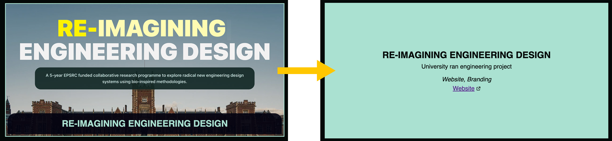
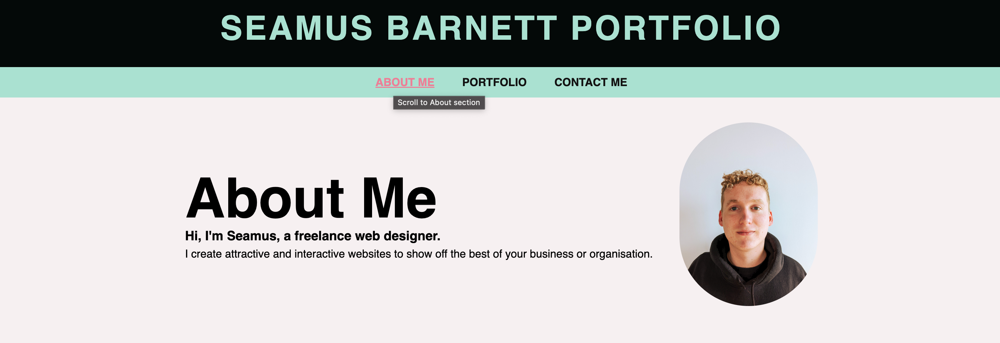

# Seamus's Portfolio

## Description

This is my front-end developer portfolio, designed to introduce myself to potential clients, show them my previous work, and give information on how they can get in touch with me.

Through creating this site I developed my skills with responsive web design. I also improved my semantic html and accessibility knowledge, part of which was adding 'title' tags to links and an 'external-link' icon to external links.

## Installation

To view the website visit [fawltya.github.io/portfolio](https://fawltya.github.io/portfolio)

## Usage

Hover over a portfolio card to see more information and experience a flip effect via css.

Use the anchor links in the navigation bar to jump to different sections on the page.

## Credits

Javascript date code used on the Copyright footer from [Kelsey Martin Copyright Notice](https://kerstinmartin.com/blog/copyright-notice)

## License

MIT License

---
